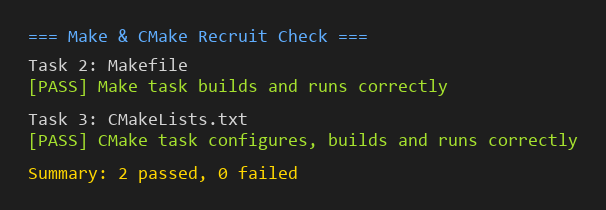

# Task 4：思考题

## 第 1 问：Make 和 build.sh 的区别

我之前在 make-task 里做过实验：先 `make` 全量编一遍，再用 `touch src/calculator.c` 模拟改了一个文件，再 `make` 一次看输出。

- `build.sh` 每次都把里面所有 `gcc` 命令**完整地跑一遍**，不管文件有没有改过。
- Makefile 是**声明式**的，写的是"目标依赖什么、怎么生成"，由 `make` 自己根据文件的**修改时间**判断哪些要重做、哪些可以跳过。
- 改文件名的话：`build.sh` 要手动改命令；Makefile 也要改两处（依赖列表 + 对应的编译规则），但整体更系统。

**结论：** 项目小的时候两者差不多，文件一多，Make 的增量构建就明显省事——我只改 `calculator.c`，它就只重编 `calculator.o`，再链一次，其他 `.o` 都是 `up to date`。

## 第 2 问：CMake 是编译器吗？

**不是。** CMake 自己是**构建系统的生成器**，不是编译器。

我跑了 `cmake -S . -B build` 之后，去 `build/` 目录里看，生成了一个 `Makefile`（还有 `CMakeCache.txt` 等），但**没有任何 `.o` 和可执行文件**。

后面 `cmake --build build` 实际是进 `build/` 目录执行 `make`，`make` 再去调 `gcc` 编译。所以**真正干编译活的是 gcc，CMake 只负责写好 Makefile**。

也正因为 CMake 只生成构建文件不编译，所以同一份 `CMakeLists.txt` 在 Linux 上能生成 Makefile，在 Windows 上能生成 VS 工程——这就是 CMake 的价值。

## 第 3 问：为什么多文件项目只改一个 .c 时不希望全部重编？

**从时间角度：** 单个 `.c` 编成 `.o` 几秒搞定，但项目里几十上百个文件全量重编可能要几分钟甚至几十分钟。开发时我可能一分钟就改十次代码，每次都全量编译太慢了。

**从机制角度：** Make 按目标与依赖的**修改时间**比较来决定要不要重编——`.c` 比 `.o` 新就重编，`.o` 比 `.c` 新就跳过。

**和第 1 问呼应：** 我刚才 `touch src/calculator.c` 后再 `make`，输出里只看到 `calculator.o` 被重编，然后重新链 `calculator`，`main.o` 和 `logger.o` 都是 `up to date`——这就是增量构建的实际效果。

---

## 自检结果

按官方要求，跑一遍 `./check.sh` 验证所有任务都通过：



```text
=== Make & CMake Recruit Check ===

Task 2: Makefile
[PASS] Make task builds and runs correctly

Task 3: CMakeLists.txt
[PASS] CMake task configures, builds and runs correctly

Summary: 2 passed, 0 failed
```